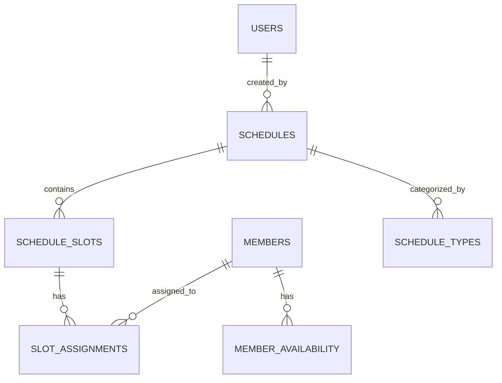

# 📅 Plano de Implementação: Sistema de Controle de Escalas de Trabalho

**Projeto**: Sverdlov - Unidade Popular  
**Data de Criação**: 2026-01-18  
**Status**: ✅ Implementado (Fases 1-4 concluídas)  
**Prioridade**: Alta  
**Última Atualização**: 2026-01-18 14:03

---

## 📋 Sumário Executivo

Este plano detalha a implementação de um sistema completo de **Controle de Escalas de Trabalho** integrado à plataforma Sverdlov. O sistema permitirá gerenciar escalas de tarefas, turnos e atividades militantes, garantindo organização eficiente das responsabilidades dos membros da organização.

### Objetivos Principais

- ✅ Criar e gerenciar escalas de trabalho/atividades
- ✅ Atribuir membros a turnos e tarefas específicas
- ✅ Visualização em calendário e timeline
- ✅ Controle de disponibilidade dos membros
- ✅ Notificações e lembretes automáticos
- ✅ Relatórios de participação e frequência

---

## 🏗️ Arquitetura do Sistema

### Stack Tecnológica (Alinhada ao Projeto)

| Camada | Tecnologia |
|--------|------------|
| Frontend | Next.js 16+ (App Router), React 19, TypeScript |
| Estilização | Tailwind CSS 4, Framer Motion |
| Backend | Next.js API Routes, Server Actions |
| Banco de Dados | Neon PostgreSQL (Serverless) |
| ORM | Drizzle ORM |
| Autenticação | JWT (jose) + RBAC |

### Entidades do Sistema



---

## 📊 Fases de Implementação

### 🔷 Fase 1: Modelagem de Dados (2-3 dias)

#### 1.1 Schema do Banco de Dados

Criar novos schemas em `src/lib/db/schema/`:

```typescript
// schedules.ts - Escalas principais
export const schedules = pgTable('schedules', {
    id: uuid('id').defaultRandom().primaryKey(),
    name: text('name').notNull(),
    description: text('description'),
    type: text('type', { 
        enum: ['weekly', 'monthly', 'event', 'permanent'] 
    }).notNull(),
    category: text('category', {
        enum: ['vigilancia', 'formacao', 'agitacao', 'administrativa', 'financeira', 'outras']
    }).notNull(),
    startDate: timestamp('start_date').notNull(),
    endDate: timestamp('end_date'),
    isRecurring: boolean('is_recurring').default(false),
    recurringPattern: jsonb('recurring_pattern'), // { frequency: 'weekly', daysOfWeek: [0,2,4] }
    territoryScope: text('territory_scope'), // Estado/Cidade
    nucleusId: uuid('nucleus_id'),
    createdById: uuid('created_by_id').references(() => users.id),
    status: text('status', { enum: ['draft', 'active', 'completed', 'cancelled'] }).default('draft'),
    createdAt: timestamp('created_at').defaultNow().notNull(),
    updatedAt: timestamp('updated_at').defaultNow().notNull(),
});

// schedule_slots.ts - Turnos/Horários
export const scheduleSlots = pgTable('schedule_slots', {
    id: uuid('id').defaultRandom().primaryKey(),
    scheduleId: uuid('schedule_id').references(() => schedules.id).notNull(),
    name: text('name').notNull(), // "Turno Manhã", "Vigília Noturna", etc
    date: date('date').notNull(),
    startTime: time('start_time').notNull(),
    endTime: time('end_time').notNull(),
    location: text('location'),
    maxParticipants: integer('max_participants').default(10),
    minParticipants: integer('min_participants').default(1),
    notes: text('notes'),
    status: text('status', { enum: ['open', 'full', 'in_progress', 'completed', 'cancelled'] }).default('open'),
    createdAt: timestamp('created_at').defaultNow().notNull(),
});

// slot_assignments.ts - Atribuições de membros
export const slotAssignments = pgTable('slot_assignments', {
    id: uuid('id').defaultRandom().primaryKey(),
    slotId: uuid('slot_id').references(() => scheduleSlots.id).notNull(),
    memberId: uuid('member_id').references(() => members.id).notNull(),
    assignedById: uuid('assigned_by_id').references(() => users.id),
    role: text('role', { enum: ['participant', 'leader', 'backup'] }).default('participant'),
    status: text('status', { 
        enum: ['pending', 'confirmed', 'declined', 'attended', 'absent', 'excused'] 
    }).default('pending'),
    confirmationDate: timestamp('confirmation_date'),
    checkInTime: timestamp('check_in_time'),
    checkOutTime: timestamp('check_out_time'),
    notes: text('notes'),
    createdAt: timestamp('created_at').defaultNow().notNull(),
});

// member_availability.ts - Disponibilidade dos membros
export const memberAvailability = pgTable('member_availability', {
    id: uuid('id').defaultRandom().primaryKey(),
    memberId: uuid('member_id').references(() => members.id).notNull(),
    dayOfWeek: integer('day_of_week').notNull(), // 0-6 (Domingo-Sábado)
    startTime: time('start_time').notNull(),
    endTime: time('end_time').notNull(),
    isAvailable: boolean('is_available').default(true),
    notes: text('notes'),
    validFrom: date('valid_from'),
    validUntil: date('valid_until'),
    createdAt: timestamp('created_at').defaultNow().notNull(),
});

// schedule_exceptions.ts - Exceções de disponibilidade
export const scheduleExceptions = pgTable('schedule_exceptions', {
    id: uuid('id').defaultRandom().primaryKey(),
    memberId: uuid('member_id').references(() => members.id).notNull(),
    date: date('date').notNull(),
    reason: text('reason'),
    isUnavailable: boolean('is_unavailable').default(true),
    createdAt: timestamp('created_at').defaultNow().notNull(),
});
```

#### 1.2 Migrations

```bash
npm run db:generate   # Gerar migrations
npm run db:push       # Aplicar ao banco
```

#### Entregáveis Fase 1: ✅ CONCLUÍDO
- [x] Schema `schedules.ts` (unificado com todos os schemas)
- [x] Schema `schedule_slots.ts` (incluído em schedules.ts)
- [x] Schema `slot_assignments.ts` (incluído em schedules.ts)
- [x] Schema `member_availability.ts` (incluído em schedules.ts)
- [x] Schema `schedule_exceptions.ts` (incluído em schedules.ts)
- [x] Atualização do `index.ts` com exports
- [x] Migrations geradas (`drizzle/0001_rapid_red_wolf.sql`) e aplicadas

---

### 🔷 Fase 2: API Backend (3-4 dias)

#### 2.1 Server Actions

Criar em `src/app/actions/`:

```
actions/
├── schedules.ts          # CRUD de escalas
├── schedule-slots.ts     # CRUD de turnos
├── slot-assignments.ts   # Atribuições de membros
└── availability.ts       # Disponibilidade dos membros
```

#### 2.2 Funcionalidades das Actions

**`schedules.ts`**:
- `createSchedule(data)` - Criar nova escala
- `updateSchedule(id, data)` - Atualizar escala
- `deleteSchedule(id)` - Remover escala
- `getSchedules(filters)` - Listar com filtros
- `getScheduleById(id)` - Detalhes da escala
- `duplicateSchedule(id)` - Duplicar escala existente
- `generateRecurringSlots(scheduleId)` - Gerar turnos recorrentes

**`schedule-slots.ts`**:
- `createSlot(data)` - Criar turno
- `updateSlot(id, data)` - Atualizar turno
- `deleteSlot(id)` - Remover turno
- `getSlotsBySchedule(scheduleId)` - Listar turnos de uma escala
- `getSlotsByDateRange(startDate, endDate)` - Turnos por período

**`slot-assignments.ts`**:
- `assignMemberToSlot(slotId, memberId, role)` - Atribuir membro
- `removeAssignment(assignmentId)` - Remover atribuição
- `confirmAssignment(assignmentId)` - Confirmar participação
- `declineAssignment(assignmentId, reason)` - Recusar
- `checkIn(assignmentId)` - Registrar entrada
- `checkOut(assignmentId)` - Registrar saída
- `getAssignmentsByMember(memberId)` - Escalas do membro
- `getAssignmentsBySlot(slotId)` - Membros do turno
- `autoAssignByAvailability(slotId)` - Auto-sugerir membros

**`availability.ts`**:
- `setWeeklyAvailability(memberId, availability[])` - Definir disponibilidade semanal
- `addException(memberId, date, reason)` - Adicionar exceção
- `removeException(exceptionId)` - Remover exceção
- `getAvailability(memberId)` - Consultar disponibilidade
- `getAvailableMembers(date, startTime, endTime)` - Membros disponíveis

#### Entregáveis Fase 2: ✅ CONCLUÍDO
- [x] `schedules.ts` com todas as actions (CRUD, duplicar, recorrência, estatísticas)
- [x] `schedule-slots.ts` com todas as actions (CRUD, por período, capacidade)
- [x] `slot-assignments.ts` com todas as actions (atribuir, confirmar, check-in/out, sugestão automática)
- [x] `availability.ts` com todas as actions (disponibilidade semanal, exceções, membros disponíveis)
- [ ] Testes unitários para cada action (pendente)

---

### 🔷 Fase 3: Interface do Usuário (5-7 dias)

#### 3.1 Estrutura de Páginas

```
src/app/(protected)/
├── escalas/                      # Rota principal
│   ├── page.tsx                  # Lista de escalas (cards/grid)
│   ├── nova/
│   │   └── page.tsx              # Criar nova escala
│   ├── [id]/
│   │   ├── page.tsx              # Visualizar escala (timeline)
│   │   ├── editar/
│   │   │   └── page.tsx          # Editar escala
│   │   └── turnos/
│   │       └── page.tsx          # Gerenciar turnos
│   ├── calendario/
│   │   └── page.tsx              # Visualização calendário
│   └── minha-agenda/
│       └── page.tsx              # Escalas do membro logado
```

#### 3.2 Componentes UI

```
src/components/
├── schedules/
│   ├── ScheduleCard.tsx          # Card de escala
│   ├── ScheduleList.tsx          # Lista de escalas
│   ├── ScheduleForm.tsx          # Formulário criar/editar
│   ├── ScheduleTimeline.tsx      # Timeline de turnos
│   ├── ScheduleCalendar.tsx      # Visualização calendário
│   ├── ScheduleStats.tsx         # Estatísticas da escala
│   ├── SlotCard.tsx              # Card de turno
│   ├── SlotForm.tsx              # Formulário de turno
│   ├── SlotAssignmentList.tsx    # Lista de atribuições
│   ├── MemberAssignModal.tsx     # Modal atribuir membro
│   ├── AvailabilityEditor.tsx    # Editor de disponibilidade
│   ├── AvailabilityGrid.tsx      # Grid semanal de disponibilidade
│   ├── QuickCheckIn.tsx          # Check-in rápido
│   └── ParticipationBadge.tsx    # Badge de status
```

#### 3.3 Design System - Escalas

**Cores por Categoria**:
```css
/* Categorias de Escalas */
--color-vigilancia: #ef4444;    /* Vermelho - Urgência */
--color-formacao: #3b82f6;      /* Azul - Educação */
--color-agitacao: #f59e0b;      /* Amarelo - Energia */
--color-administrativa: #6b7280; /* Cinza - Neutro */
--color-financeira: #10b981;    /* Verde - Finanças */
--color-outras: #8b5cf6;        /* Roxo - Outros */
```

**Status dos Turnos**:
```css
--status-open: #22c55e;         /* Verde - Aberto */
--status-full: #f59e0b;         /* Amarelo - Lotado */
--status-in-progress: #3b82f6;  /* Azul - Em andamento */
--status-completed: #6b7280;    /* Cinza - Concluído */
--status-cancelled: #ef4444;    /* Vermelho - Cancelado */
```

#### 3.4 Funcionalidades da Interface

**Página Principal de Escalas**:
- Grid de cards com escalas ativas
- Filtros por categoria, status, período
- Busca por nome
- Botão "Nova Escala"
- Indicadores de ocupação (vagas preenchidas/total)

**Visualização de Escala (Timeline)**:
- Timeline horizontal/vertical dos turnos
- Drag-and-drop para mover membros
- Indicadores visuais de preenchimento
- Quick actions (confirmar, cancelar)

**Calendário**:
- Visualização mensal/semanal
- Cores por categoria
- Click para expandir detalhes
- Arrastar para criar novo turno

**Minha Agenda**:
- Lista de próximas escalas do membro
- Botões de confirmar/recusar
- Histórico de participações
- % de frequência

#### Entregáveis Fase 3: 🚧 EM PROGRESSO
- [x] Página de listagem de escalas (`/escalas/page.tsx`)
- [x] Formulário de criar escala (`/escalas/nova/page.tsx`)
- [x] Página de visualização com turnos (`/escalas/[id]/page.tsx`)
- [x] Página de calendário (`/escalas/calendario/page.tsx`)
- [x] Página "Minha Agenda" (`/escalas/minha-agenda/page.tsx`)
- [x] Link no sidebar adicionado
- [ ] Formulário de editar escala
- [ ] Página de gerenciamento de turnos
- [ ] Componentes reutilizáveis separados
- [ ] Responsividade mobile completa

---

### 🔷 Fase 4: Funcionalidades Avançadas (3-4 dias)

#### 4.1 Sistema de Notificações

```typescript
// src/lib/notifications/schedule-notifications.ts
interface ScheduleNotification {
    type: 'assignment' | 'reminder' | 'change' | 'confirmation_request';
    recipientId: string;
    scheduleId: string;
    slotId?: string;
    message: string;
    scheduledFor?: Date;
}

// Tipos de notificação:
// - Nova atribuição
// - Lembrete 24h antes
// - Lembrete 1h antes
// - Alteração de horário
// - Confirmação pendente
// - Cancelamento
```

#### 4.2 Relatórios e Analytics

```typescript
// src/app/actions/schedule-reports.ts

// Métricas principais:
- Taxa de participação por membro
- Taxa de ocupação por escala
- Comparativo mensal de participações
- Membros mais/menos ativos
- Horários com maior demanda
- Categorias mais utilizadas
```

**Dashboard de Escalas**:
- KPIs: Total de escalas ativas, Participações do mês, Taxa de confirmação
- Gráfico: Participação por categoria
- Gráfico: Evolução mensal
- Top 10 membros mais participativos

#### 4.3 Auto-alocação Inteligente

```typescript
// src/lib/schedule/auto-assign.ts
async function autoAssignMembers(slotId: string): Promise<SuggestedAssignment[]> {
    // 1. Buscar membros disponíveis no horário
    // 2. Verificar carga de trabalho atual (evitar sobrecarga)
    // 3. Considerar histórico de participação
    // 4. Priorizar por nível de militância
    // 5. Distribuir equitativamente
    // 6. Retornar sugestões ordenadas
}
```

#### 4.4 Integração com Calendário Existente

- Sincronizar escalas com `/calendar`
- Eventos de escala aparecem no calendário geral
- Cores diferenciadas por categoria

#### Entregáveis Fase 4:
- [ ] Sistema de notificações implementado
- [ ] Dashboard de relatórios
- [ ] Auto-alocação inteligente
- [ ] Integração com calendário existente
- [ ] Exportação de relatórios (PDF/Excel)

---

### 🔷 Fase 5: Testes e Refinamentos (2-3 dias)

#### 5.1 Testes Automatizados

```
__tests__/
├── schedules/
│   ├── schedules.test.ts        # Testes de CRUD escalas
│   ├── slots.test.ts            # Testes de turnos
│   ├── assignments.test.ts      # Testes de atribuições
│   ├── availability.test.ts     # Testes de disponibilidade
│   └── reports.test.ts          # Testes de relatórios
```

#### 5.2 Testes de Integração

- Fluxo completo de criar escala → adicionar turnos → atribuir membros → check-in
- Fluxo de auto-alocação
- Fluxo de disponibilidade e exceções

#### 5.3 Testes E2E (Opcional)

- Playwright para fluxos críticos
- Screenshots para validação visual

#### Entregáveis Fase 5:
- [ ] Testes unitários (cobertura > 80%)
- [ ] Testes de integração
- [ ] Documentação de uso
- [ ] Ajustes de UX baseados em feedback

---

## 📅 Cronograma Estimado

| Fase | Descrição | Duração | Dependências |
|------|-----------|---------|--------------|
| 1 | Modelagem de Dados | 2-3 dias | - |
| 2 | API Backend | 3-4 dias | Fase 1 |
| 3 | Interface do Usuário | 5-7 dias | Fase 2 |
| 4 | Funcionalidades Avançadas | 3-4 dias | Fase 3 |
| 5 | Testes e Refinamentos | 2-3 dias | Fase 4 |
| **Total** | | **15-21 dias** | |

---

## 🔐 Controle de Acesso (RBAC)

| Ação | National Admin | State Leader | Municipal Leader | Member |
|------|----------------|--------------|------------------|--------|
| Criar escala | ✅ | ✅ (seu território) | ✅ (sua cidade) | ❌ |
| Editar escala | ✅ | ✅ (seu território) | ✅ (sua cidade) | ❌ |
| Deletar escala | ✅ | ✅ (seu território) | ❌ | ❌ |
| Atribuir membros | ✅ | ✅ | ✅ | ❌ |
| Ver todas escalas | ✅ | ✅ (seu território) | ✅ (sua cidade) | Próprias |
| Confirmar participação | ✅ | ✅ | ✅ | ✅ (própria) |
| Ver relatórios | ✅ | ✅ (seu território) | ✅ (sua cidade) | ❌ |

---

## 📱 Requisitos de UX/Mobile

### Mobile-First Design
- Todas as telas responsivas
- Gestos de swipe para confirmar/recusar
- Check-in via QR Code (futuro)
- PWA para acesso offline

### Acessibilidade
- Contraste adequado
- Navegação por teclado
- Labels em todos os inputs
- Feedback visual e sonoro

---

## 🚀 Próximos Passos (Pós-MVP)

1. **Integração WhatsApp**: Notificações via WhatsApp Business API
2. **QR Code Check-in**: Check-in via leitura de QR
3. **Gamificação**: Badges e pontos por participação
4. **Escalas Voluntárias**: Membros podem se candidatar a turnos
5. **Substituições**: Sistema de troca entre membros
6. **Templates**: Escalas pré-configuradas reutilizáveis

---

## 📚 Referências

- [Documentação do Projeto](./project-overview.md)
- [Arquitetura do Sistema](./architecture.md)
- [Drizzle ORM](https://orm.drizzle.team/)
- [Next.js App Router](https://nextjs.org/docs/app)

---

**Autor**: Plano gerado automaticamente  
**Última atualização**: 2026-01-18
